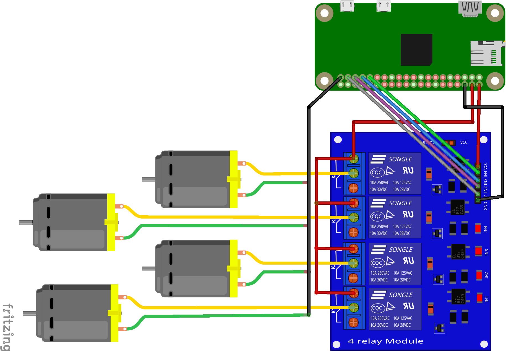

# smart-gardening

## Hardware

* Raspberry Pi Zero W
* 40 Pin GPIO Header für Raspberry Pi
* 5V 4 Kanal Relais Modul
* 4 x DC 3-5V mini aquarium pump
* pvc hose (5 mm)
* jumper cables
* copper strand (approx. 10 m)

## Schematic



## Software

### smart-gardening/watering.py

MQTT client listening on specified topic with subtopics. When callback receives
message ``on``, a new Thread get's started to handle switch of GPIO output for
watering pumps. Only one pump at a time will start because of acquiring a lock
object first. In addition, thread will wait for its event to stop watering and
release lock again. Event will get set when message ``off`` was sent.

This script should be setup as system service to start automatically and restart
on failure. Find an example systemctl service file at `templates/watering.service`.

### smart-gardening/cronjob.py

This script iterates through all specified plants and publishes command `on`
on associated topic (see `settings.py`). After a while, it publishes `off`
to stop watering again. All plants are handled sequentially to not waste any
amount of time due to limitation of parallelism of pumps.

This script should be called periodically by cronjob. Find an example crontab
file at `templates/crontab`.

### smart-gardening/settings.py

This file's only sense is to set all necessary settings.

| variable               | description                                           |
| ---------------------- | ----------------------------------------------------- |
| `LOG_LEVEL`            | threshold for logger object                           |
|                        |                                                       |
| `MQTT_HOST`            | host with mqtt server running (e. g. mosquitto)       |
| `MQTT_PORT`            | open mqtt port on server                              |
| `MQTT_TOPIC`           | base topic to publish data (see `WATER_PUMP_CHANNEL`) |
|                        |                                                       |
| `NAME`                 | placeholder for name of the plant (never used)        |
| `MOISTURE_PIN`         | pin of MCP3008 analog-to-digital converter            |
| `MOISTURE_THRESHOLD`   | above this threshold the pump will turn on            |
| `CHECK_MOISTURE_LEVEL` | whether to use moisture sensor at all                 |
| `WATER_PUMP_GPIO`      | GPIO number (BCM) for the relay                       |
| `WATER_PUMP_CHANNEL`   | mqtt input channel (subtopic) for the relay           |
| `WATERING_TIME`        | seconds how long the pump should be turned on         |

### smart-gardening/vault.yml

For providing credentials for PushNotifier application in yaml style. You find
further information on the website:
https://pushnotifier-python.readthedocs.io/en/latest/getting-started.html

| variable               | description                                           |
| ---------------------- | ----------------------------------------------------- |
| `USE_MOCK`             | whether to use push notification at all               |
| `USER`                 | your username from https://pushnotifier.de            |
| `PASSWORD`             | your password from https://pushnotifier.de            |
| `PACKAGE`              | the package you want to send your messages to         |
| `API_KEY`              | your api key from https://pushnotifier.de/account/api |
| `DEVICES`              | devices linked to your PushNotifier account           |

File must be encrypted with `ansible-vault`, pass vault password file path (optional)
to native script:

```shell
$ python3 watering.py --vault-password-file .vault-pass.txt
```

Example `vault.yml`:

```yaml
PUSHNOTIFIER:
  USE_MOCK: False
  USER: "tokr"
  PASSWORD: "password"
  PACKAGE: "com.watering.rpi.local.app"
  API_KEY: "abcdefghijkl_12345"
  DEVICES: ["iphone"]
```